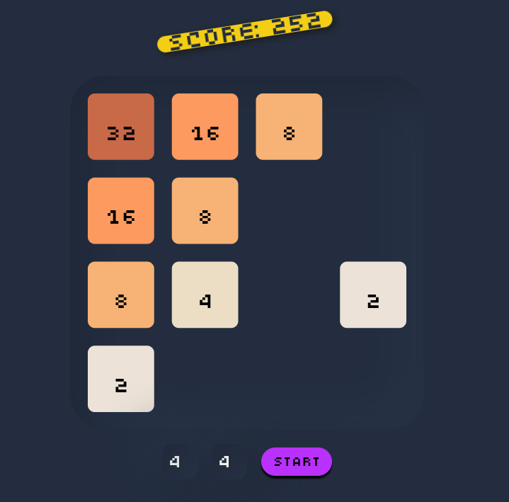

## 2048 game

The game was written as a test task using the Canvas API. Control is carried out through the arrows on the keyboard, or by swipes. Each move is saved in localStorage. It is possible to change the size of the board.

---

<a href="https://dadajonovich.github.io/2048-game-canvas/">Game on GitHub Pages</a>

---

